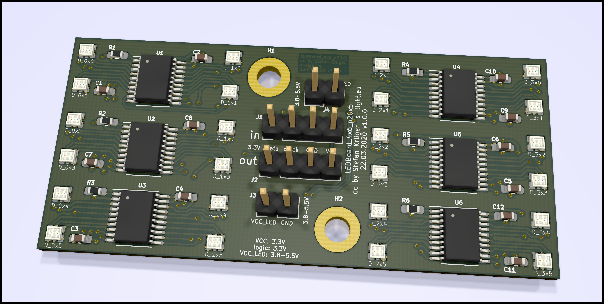

<!--lint disable maximum-line-length-->
<!--lint disable list-item-spacing-->
<!--lint disable list-item-indent-->

# LEDBoard_4x6_p20x5



- LEDBoard with 4x6 LEDs
- pixel pitch: 20mm x 5mm
- LED: [Rohm MSL0402RGB](https://www.rohm.com/datasheet/MSL0402RGBU) (1.8x1.6x0.5mm RGB)
- Driver: [TI TLC5971](http://www.ti.com/product/TLC5971) (16bit dimming, constant current driver)


## Project-Status
WIP
- [ ] design schematics
- [ ] layout pcb
- [ ] order pcbs
- [ ] solder boards
- [ ] test
- [ ] update documentation

## Technical Information
there are groups of 4 LEDs that are controlled by one TLC5971.  
every controller chip has 12 ConstantCurrent outputs. so every LED is controllable individual.

you need to create a mapping to linearize the order:  

TODO: Add Ordering
<!--
| X/Y   | 0        | 1        | 2        | 3        |
| :---- | :------- | :------- | :------- | :------- |
| **0** | IC1 LED1 | IC1 LED2 | IC2 LED1 | IC2 LED2 |
| **1** | IC1 LED3 | IC1 LED4 | IC2 LED3 | IC2 LED4 |
| **2** | IC3 LED1 | IC3 LED2 | IC4 LED1 | IC4 LED2 |
| **3** | IC3 LED3 | IC3 LED4 | IC4 LED3 | IC4 LED4 |

example for c++ / arduino
```c++
const uint8_t channel_position_map[4][4] = {
    { 0,  1,  4,  5},
    { 2,  3,  6,  7},
    { 8,  9, 12, 13},
    {10, 11, 14, 15},
};
``` -->

### HW
- PCB size: ?x?x1,6mm
- pixel-pitch: 20x5mm
- 3.8V..5.5V
- <= ??A (maximum)

### controlling
for arduino you can use [ulrichstern/Tlc59711](https://github.com/ulrichstern/Tlc59711)

for other things have a look at [LEDBoard_4x4_16bit](https://github.com/s-light/LEDBoard_4x4_16bit#controlling)


---

# License
<!-- license info -->
<p>
<a rel="license" href="http://creativecommons.org/licenses/by/4.0/">
    
</a>
<br />
<span xmlns:dct="http://purl.org/dc/terms/" property="dct:title">
    all files in LEDBoard_4x6_p20x5
</span> by
<a xmlns:cc="http://creativecommons.org/ns#"
        href="https://github.com/s-light/LEDBoard_4x6_p20x5"
        property="cc:attributionName"
        rel="cc:attributionURL">
    Stefan Krüger (s-light)
</a>
are licensed under a<br/>
<a rel="license" href="http://creativecommons.org/licenses/by/4.0/">
    Creative Commons Attribution 4.0 International License
</a>.
</p>

all software parts/files are licensed under [MIT](LICENSE).


<!-- license info end -->
